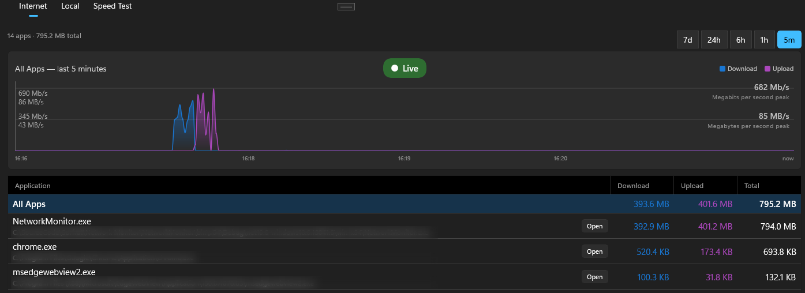
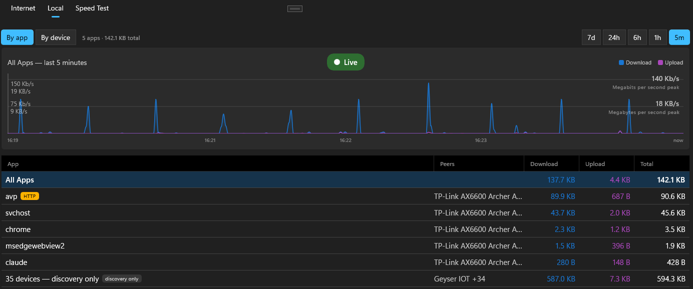
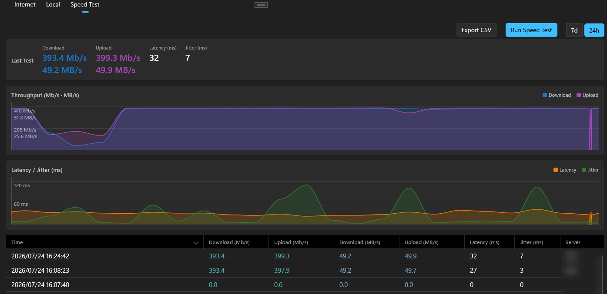
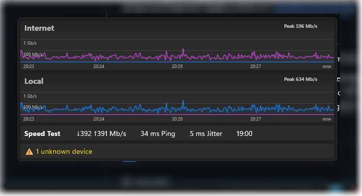
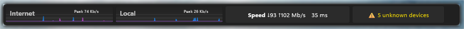
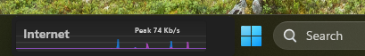

# Umnatha Network Monitor

This project started as a way to learn Agentic Engineering using Claude Code. It started with a need to monitor the activity of my many Home Assistant IoT devices and automations. From there it grew in scope to become a general network monitor.

The name Umnatha comes from isiXhosa, one of South Africa's indigenous languages, where it means 'Net'. (Pronounced oom-NAH-tah.)

This app is a Windows desktop app that watches your local network: it scans continuously, tracks every device it finds, and measures per-application bandwidth straight from the kernel. No data ever leaves your machine. Everything — devices, traffic, speed-test history, daily digests — is stored locally in SQLite.

  
   
  <em>Live per-application internet bandwidth</em>

  
   
  <em>Local network traffic, pivoted by app or by device</em>

  
   
  <em>Hourly download / upload / latency / jitter speed tests</em>

  
   
  <em>The floating mini graph — live throughput, last speed test and unknown devices, always on top</em>

  
   
  <em>The same widget as a short, wide strip — Internet, Local, speed test and unknown devices side by side</em>

  
   
  <em>Narrowed to a single section and dragged onto the taskbar, beside Start and Search</em>

## What it does

- **Scans the network** on a configurable interval (default: every 5 minutes) using ICMP ping, ARP table parsing, and reverse DNS lookup.
- **Tracks devices** by MAC address across IP changes and DHCP renewals, and classifies them by type (router, PC, mobile, camera, etc.) with vendor lookup from the IEEE OUI database.
- **Names devices via mDNS** — a per-scan DNS-SD (Bonjour) discovery pass fills in a friendly name and hardware model for devices that vendor and reverse-DNS lookups can't identify, chiefly randomized-MAC gear; discovered values never overwrite a name you've set.
- **Maintains a known-devices list** — approve any device to give it a friendly name, type and notes; approved devices stop showing as unknown, and the whole list imports and exports as CSV.
- **Measures per-application traffic** — captures upload/download bytes per process directly from the Windows kernel (ETW) and charts it live, split into **Internet** (WAN) and **Local** (LAN) views. The Local view pivots **by app or by device**, folds away device-discovery chatter, tags SMB/file-share flows, and shows a live throughput badge (Mb/s · MB/s) on whatever's actively transferring.
- **Floats a mini graph on the desktop** — an optional always-on-top widget showing live Internet and Local throughput, the last speed test and any unknown devices, without keeping the main window open. It sits at whatever opacity you choose and rises to full when you hover it; double-click any section to jump straight to that page. It can also be laid out as a short, wide horizontal strip that is short enough to sit over the taskbar if you drag it there, with a width that follows whichever sections you enable and a height you set by dragging its edge.
- **Measures internet speed** — an hourly download/upload/latency/jitter test against Cloudflare, no account needed.
- **Generates a daily digest** summarising device activity and traffic, exportable to PDF or CSV.
- **Alerts via Windows toast + in-app banner** when a device appears or disappears, optionally limited to unknown devices only. Clicking a toast opens the app at the part it is about — an unknown device at the Unapproved list, a known one at its history.
- **Keeps a history** of every appearance and disappearance, browsable per device, with automatic purging of old events.
- **Backs itself up** — a timestamped database snapshot every 24 hours, pruned automatically.
- **Lives in the system tray**, with an optional start-with-Windows setting.

See [`Documents/Overview.md`](Documents/Overview.md) for the full feature tour, page-by-page, plus the complete settings reference. [`Documents/Architecture.md`](Documents/Architecture.md) covers the internals.

## Screenshots

- [Devices](Documents/Images/Devices.png) — every device on the network, tracked by MAC with type, vendor and live status.
- [Internet traffic](Documents/Images/Internet.png) — per-application WAN bandwidth with a live download/upload chart.
- [Local traffic](Documents/Images/Local.png) — LAN traffic pivoted by app or device, with discovery chatter folded away.
- [Floating mini graph](Documents/Images/MiniGraph.png) — the always-on-top widget: live Internet and Local throughput, last speed test, unknown devices.
- [Speed test](Documents/Images/Speedtest.png) — hourly Cloudflare download/upload/latency/jitter history.
- [Daily digest](Documents/Images/DigestReport.png) — a summary report of device activity and traffic, exportable to PDF.
- [Horizontal mini graph](Documents/Images/HorizontalMiniGraph.png) — the same widget laid out as a short, wide strip: Internet and Local throughput, the last speed test and the unknown-device count side by side.
- [Mini graph on the taskbar](Documents/Images/HorizontalMiniGraphInTaskBar.png) — the strip narrowed to a single section and dragged onto the taskbar, sitting alongside Start and Search.

## Requirements

- Windows 10 (build 17763) or later, x64.
- Runs **as administrator** — capturing per-process traffic requires a kernel-level ETW session. If launched without admin rights, it relaunches itself elevated automatically.

## Building from source

- Open `NetworkMonitor.slnx` in Visual Studio 2026 (or later).
- Set the solution platform to **x64** — WinUI 3 does not support "Any CPU".
- Restore NuGet packages, then build. Requires .NET 10 and the Windows App SDK workload.

See [`CONTRIBUTING.md`](CONTRIBUTING.md) for coding conventions and how to run the test suite.

## Development practice

This project is an experiment in agentic engineering, but the process around it is deliberate — nothing substantial is written straight from a prompt. Every non-trivial feature goes design → plan → implementation → review, and each stage leaves a document behind in the repository.

**A design spec comes first.** Features start as a dated spec in [`Documents/superpowers/specs/`](Documents/superpowers/specs), written and approved before any code exists. A spec states the problem, the alternatives considered and why they were rejected, the behaviour at the edges, and the database impact. The [horizontal mini graph spec](Documents/superpowers/specs/2026-08-05-horizontal-mini-graph-design.md) is representative: it opens by establishing that the originally requested approach — genuinely docking into the Windows 11 taskbar — has no supported API, compares the three routes that remain, and explains the trade-off behind the one chosen.

**Then an implementation plan.** The approved spec becomes a task-by-task plan in [`Documents/superpowers/plans/`](Documents/superpowers/plans): the file-by-file structure, the ordering, the conventions and layering rules that apply, a measured test-count baseline no later task may fall below, and an explicit statement of whether the change needs an EF Core migration. Schema changes ship their migration in the same commit — a released app's database holds the only copy of a user's history, so "delete the database and let it rebuild" is never the answer.

**Structured code review.** Reviews follow a repeatable procedure ([`code-review-procedure.md`](Documents/Code%20Review/code-review-procedure.md)). The codebase is split into chunks ordered by risk, and each chunk is examined for correctness, concurrency and async behaviour, resource lifetime, error handling, and convention compliance. During the review nothing is fixed — findings are recorded only, each with an ID, a severity tag, a `file:line`, a proposed fix and a status, and each chunk pauses for the maintainer to add their own findings before the next one starts. Fixes come afterwards, batched by theme, every batch built clean on x64 with the full test suite green. Two full rounds are recorded so far: [2026-06-23](Documents/Code%20Review/2026-06-23/summary.md) — 54 findings, all resolved — and [2026-07-27](Documents/Code%20Review/2026-07-27/summary.md) — 46 findings, 44 fixed, 2 won't-fix.

**Performance review.** A separate [performance review](Documents/Performance%20Review/2026-07-01/performance-review.md) covers data access, the ETW capture pipeline, the scanning pipeline, and the UI/rendering layer, ranking findings by severity and by how hot the path is. Findings deliberately *not* taken are recorded with the reasoning, so the decision can be revisited later rather than rediscovered.

**Conventions and tests.** Coding conventions are documented in [`CLAUDE.md`](CLAUDE.md), enforced mechanically by `.editorconfig` where tooling can do it and on review where it can't. Logic that can be tested without a UI lives in the Models and Core class libraries specifically so the xunit suite can reach it, and that suite is run at every task boundary and every fix batch rather than only before a release.

## Data & privacy

Everything lives locally in `%LOCALAPPDATA%\UmnathaNetworkMonitor\` — there's no cloud sync, telemetry, or account. Optional diagnostic logging (off by default) never records MAC addresses, IP addresses, or hostnames. See the *Data storage* and *Diagnostic logging* sections of [`Documents/Overview.md`](Documents/Overview.md) for exact file layouts.

## Known issues

- **After resuming from sleep, the mini graph or the tray menu can appear behind the taskbar.** Windows draws the taskbar over them even though both windows are correctly ordered above it — confirmed by a z-order dump showing the widget above `Shell_TrayWnd` while it was still hidden from view. The tray menu is affected identically despite sharing no code with the mini graph, which points at the Windows compositor rather than the app. Restarting the app does not clear it; a Windows restart does.

## Roadmap

Ideas being explored, in no particular order and with no committed timeline:

- ~~**Automatic updates** — in-app update checks and one-click upgrades.~~ Shipped in v0.0.9.
- ~~**Chart colour schemes** — selectable palettes for the traffic and speed charts.~~ Shipped in v0.0.12.
- ~~**Floating mini-graph** — a small always-on-top live throughput window.~~ Shipped in v0.0.10.
- ~~**Horizontal mini-graph** — a horizontal version of the mini graph that can be placed on top of the taskbar.~~ Shipped in v0.0.11.

## License

[MIT](LICENSE).

## Support

This project is provided as-is, maintained on a best-effort basis. Bug reports and feature ideas are welcome via Issues, but there's no guaranteed response time or roadmap commitment.
